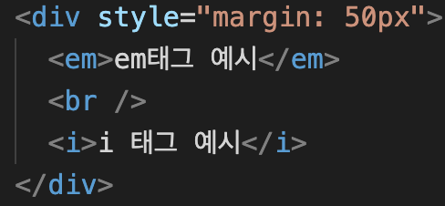

# 12월 20일 Today I Learned

---

# 💯 오늘 배운 내용 중에서 몰랐던 부분만 간략히 정리!

## 🔴 em 태그

 

 

em태그와 i태그 둘 다 글자의 기울기를 변형시켜 주는 태그이지만
em태그는 기울임과 내용에 강조를 나타낼 때 사용한다.
  

## 🔴 del 태그

 

 
s 태그와 del 태그 둘 다 글자에 취소선을 그어주는 태그이지만

del 태그는 ins 태그와 세트로 사용되어
텍스트가 제거 된 이후 추가된 텍스트를 나타낼 수 있다.
  

## 🔴 dl, dt, dd 태그

 

 
dl태그는 설명 목록 태그이다.

dl태그 안에는 설명할 제목이 들어가는 dt태그와 설명이 들어가는 dd태그가 들어간다.

dl 대신 div, dt 대신 h2, dl 대신 p태그를 쓰지 않는 이유는

dl 안에 코드가 있다는 것이 훨씬 직관적으로 어떤 내용이 들어갈지 잘 보이기 때문에

dl 태그를 사용해서 코드를 짜는 것이 좋은 코딩이라고 생각한다.

  

## 🔴 iframe 태그

iframe 태그는 내부 html파일과 외부 페이지를 불러올 수 있는 태그이다.

보안상의 이유로 외부 페이지 중에는 불러올 수 없는 페이지도 존재한다.
  

## 🔴 figure 태그

figure태그 안에는 주로 이미지, 비디오, 오디오 등 독립적인 컨탠츠로 분리되는 요소들이 들어가게 된다.

위에 dl태그와 마찬가지로 그냥 div태그 안에 담아도 되지만

figure태그 안에 코드를 담아서 더 직관적으로 어떤 내용이 들어갈 지 알 수 있다는 점에서

figure 태그를 사용하는 것 같다.
