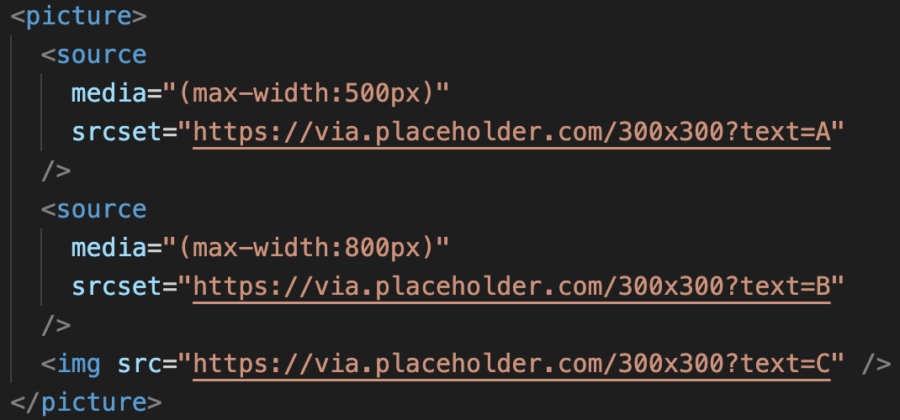

# 1월 2일 Today I Learned

---

# 💯 오늘 배운 내용 중에서 몰랐던 부분만 간략히 정리!

## 🔴 반응형

반응형이란 하나의 웹사이트에서 PC, Tablet, Mobile 등 접속하는 기기의 화면 크기에 맞게

사이트의 크기가 자동으로 반응하는 기술이다.

## 🔴 반응형 웹사이트 (HTML)

```html
<meta name="viewport" content="width=device-width, initial-scale=1.0" />
```

- viewport meta 테그를 이용하여 페이지가 로드가 될 때 브라우저에게 어떻게 화면 크기를 보여줄지 알려주는 것이다.
- content 속성 값에 width 또는 height를 넣어서 높이와 너비를 조절 할 수 있다.
- width = divice-width는 브라우저에 접속하는 기기의 너비에 맞춰서 브라우저의 너비를 조절하겠다는 의미이다.
- initial-scale은 브라우저에 접속 했을 때 초기 배율을 의미한다.



media 값은 ()안에 적어야 한다.


너비가 500px이하인 경우에는 A이미지가 출력된다.


너비가 800px 이하인 경우에는 B이미지가 출력된다.


800px 초과인 경우에는 C이미지가 출력된다.

## 🔴 반응형 웹사이트 (CSS)

```css
@media 기기유형 (규칙){
	스타일
}
```

위 코드는 media query의 사용법을 간략하게 작성한 것이다.

- 기기유형에는 all, print, screen이 들어간다.
  all : 모든 장치 (default value)
  print : 인쇄 결과물, 출력 미리보기
  screen : 화면을 가진 기기
- 규칙에는 viewport의 가로, 세로 너비, 가로세로 비율등이 들어간다.

- 스타일 작성 시 주의할 점은

1. width 값을 고정하면 반응형 매구간마다 고정값을 변경해야 하는 불편함이 발생할 수 있다.

   → max-width값을 사용하여 불편함을 해소할 수 있다.

2. height 값을 고정하면 유동적으로 변하는 높이에 대응할 수 없다.

   → min-height값을 사용하여 불편함을 해소할 수 있다.

3. 인라인 스타일은 반응형을 처리할 수 없다.

등이 있다.


and를 이용하여 조건을 여러개 사용할 수 있다.


너비 조건을 500 ~ 800px로 설정했기 때문에 위와 같은 결과가 나온것을 확인할 수 있다.
